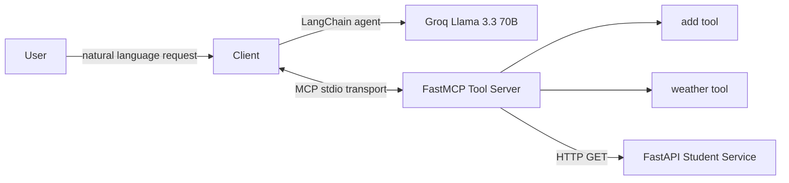

# MCP Multi-Tool AI Assistant

An agentic AI assistant that dynamically discovers and invokes tools through the Model Context Protocol (MCP), instead of hardcoding which function an LLM is allowed to call. It combines a FastMCP tool server, a LangChain agent running on Groq's Llama 3.3 70B model, and a small FastAPI backend that acts as an external system of record.

## Problem

Most "LLM with tools" demos wire the model directly to a fixed list of Python functions inside the same process. That does not reflect how tool access works in production, where tools often live behind their own services and need to be discovered at runtime. This project implements that separation properly using MCP: the agent process does not import the tools directly, it discovers them from an independent MCP server over a standard protocol and decides which one to call based on the user's natural-language request.

## Architecture



The client process starts the MCP server as a subprocess and talks to it over the MCP stdio transport using `langchain-mcp-adapters`. The MCP server exposes each tool with the `@mcp.tool()` decorator and, for the `get_student` tool, calls out over HTTP to a separate FastAPI service rather than reading from local state, which mirrors how a real internal tool would call an internal microservice.

## Tech Stack

The assistant is built with Python, the official MCP Python SDK via FastMCP, LangChain's agent runtime, `langchain-groq` for LLM access, and FastAPI for the backing student data service. Groq serves the `llama-3.3-70b-versatile` model. Configuration such as the Groq API key is loaded from environment variables with `python-dotenv` and is never committed to the repository.

## How It Works

On startup, `client.py` loads environment variables, constructs a `ChatGroq` LLM, and opens a `MultiServerMCPClient` pointed at `mcp_server.py`. It asks the MCP server for its available tools, wraps them with `langchain.agents.create_agent`, and then enters a REPL loop that takes natural-language questions from the user, lets the agent decide which tool (if any) to call, executes it through the MCP transport, and returns the model's answer.

## Key Features

The project demonstrates dynamic tool discovery over MCP rather than static function binding, a tool that itself calls a separate FastAPI microservice (`get_student`), a simple arithmetic tool (`add`) to show basic tool-calling correctness, and a weather lookup tool that calls an external weather API using a key stored outside source control.

## API Flow

A user question enters the CLI client, the LangChain agent reasons over the available MCP tool schemas and picks zero or more tools to call, each tool call is sent over the MCP stdio transport to `mcp_server.py`, the `get_student` tool issues an HTTP GET to the FastAPI service at `/student/{student_id}`, and the tool result is returned to the agent, which produces the final natural-language response.

## Setup

```bash
git clone https://github.com/yrlmanoharreddy/mcp-multi-tool-assistant.git
cd mcp-multi-tool-assistant
uv sync
cp .env.example .env
uvicorn student_api:app --reload --port 8000
uv run client.py
```

You will need a Groq API key in your `.env` file as `GROQ_API_KEY`. The MCP server itself is started automatically by `client.py`; it does not need to be run separately.

## Testing

The project currently relies on manual verification through the CLI client (asking questions that exercise each tool) rather than an automated test suite. Adding `pytest` coverage for the FastAPI endpoints and the individual MCP tool functions is a natural next step and is called out below as a known gap.

## Deployment

The services currently target local development: the FastMCP server runs over stdio as a subprocess of the client, and the FastAPI student service runs with Uvicorn on localhost. Containerizing each service and swapping the stdio transport for MCP-over-HTTP would be the next step toward a deployable version.

## Engineering Decisions

MCP was chosen over a hardcoded tool list specifically to demonstrate runtime tool discovery, which is the pattern most production agentic systems will need once tools are owned by different teams or services. Keeping the student data behind a real FastAPI HTTP call, instead of an in-process dictionary lookup, was a deliberate choice to make the `get_student` tool behave like a call to an internal microservice rather than a toy function.

## Status

This is a working prototype focused on the MCP integration pattern itself. The domain data (student records) is intentionally minimal since the point of the project is the agent-to-tool-server architecture, not the business data behind it.
